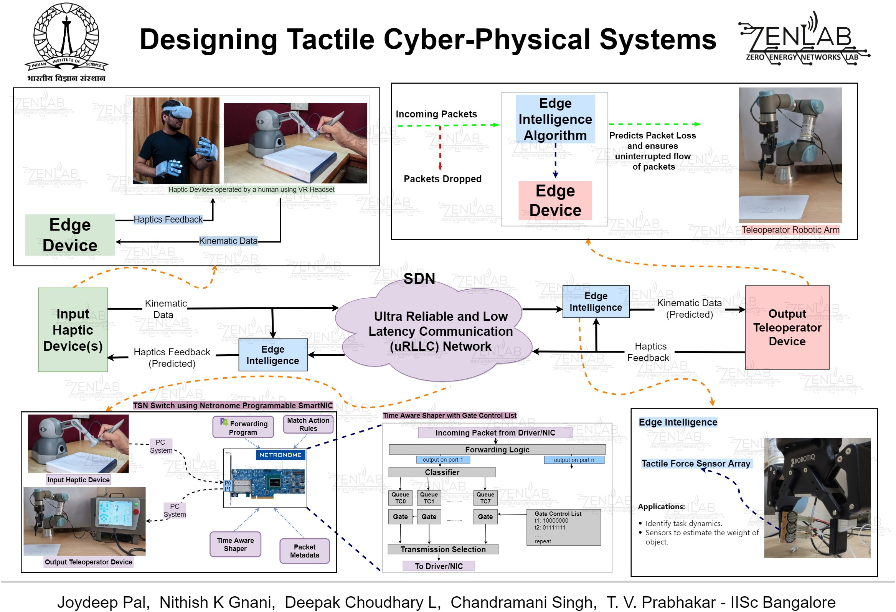

# Tactile-Cyber-Physical-Systems
This repository contains codes and guides that are being developed in the project "[Designing Tactile Cyber Physical Systems](https://labs.dese.iisc.ac.in/zenlab/ongoing-projects/tsn/)"
at Zero Energy Networks Laboratory (ZENLab), Indian Institute of Science (IISc), Bengaluru, India.

  

## Repositories:
The following repositories form the different modules in this project.  
* [Cyber-physical systems](https://github.com/nithishkgnani/CPS)  
    Setup guide and scripts for UR3 (robotic arm from Universal Robots), Robotiq 2F85 gripper, Geomagic Touch (haptic device), SenseGlove Nova (haptic gloves)
* [Scripts and tests on SmartNIC](https://github.com/deepakc7y/netronome-code)
* [Tactile internet and TSN](https://github.com/deepakc7y/TSN)  
   Links, documents and guides on TSN and tactile Internet
* [Netronome Agilio SmartNIC configuration guide](https://github.com/deepakc7y/netronome-config)
* [P4-NetFPGA-SUME Hardware guide](https://github.com/nithishkgnani/P4_Projects/tree/main/P4-NetFPGA)  
* [P4 on Netronome Agilio SmartNIC](https://github.com/soumya-rana/P4_on_netronome_agilio)  
   Collection of P4 codes running on Netronome Agilio SmartNIC.

## People
* Main contributors:
  * [Joydeep Pal](joygetsit.github.io/) ([@joygetsit](https://github.com/joygetsit)) - PhD student
  * [Nithish K Gnani](nithishkgnani.github.io/) ([@nithishkgnani](https://github.com/nithishkgnani)) - Research associate
  * [Deepak Choudhary](deepakc7y.github.io/) ([@deepakc7y](https://github.com/deepakc7y)) - Research assistant
* Other contributors:
  * Soumya Kanta Rana ([@soumya-rana](https://github.com/soumya-rana/)) - M.Tech. student
  * Himanshu Verma ([@ihimu](https://github.com/ihimu)) - M.Tech. student
  * Kaushal Mhapsekar ([@kaushal1803](https://github.com/kaushal1803)) - Intern, (B.Tech. student, BITS Goa)
* Advisors
  * Chandramani Singh - Associate Professor
  * T V Prabhakar - Principal Research Scientist

Unless specified, the above people are from Department of Electronic Systems Engineering (DESE), Indian Institute of Science (IISc), Bangalore, India.